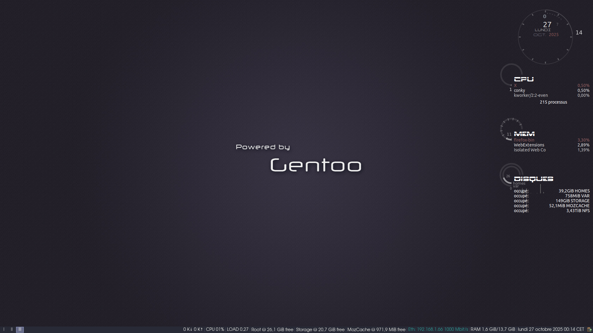

# I3 Theme and Configuration

These are my configuration files for I3 wm with my beautiful Gentoo theme !


## Screenshot

[](i3-gentoo.png)
## Installation
You will need `conky` and `ImageMagick` for the best experience. Just copy everything into your ~/.config/i3 directory.
- `config` and `containers.conf` don't need to be modified except if you need to change display resolution and/or keyboard layout
- adjust others - like `applications.conf` - depending on what you have installed in your system (I'm using Mate and Enlightenment a lot, so my conf is full of `mate-..` and `terminology` commands)
- Link Xresources or append it's content to your ~/.Xresources file
- source `bashrc` from your Bash configuration file, add this line :
```bash 
source ~/.config/i3/bashrc
```
- `dmenurc` is for those using dmenu_run command, copy or link this file to `~/.dmenurc`
- `dunstrc` needs some rework, so don't use it for now :)
- copy `netspeed.sh` to `~/.netspeed.sh`
- `picom.conf` is not used anymore, so try it at your own risk, although it was usable as of 03/2020
## Authors

- [Jack Holborn](jack.holborn@hotmail.com)
- Many sources from Internet
## Acknowledgements

 - I don't know who is this guy at [I3 Color Configurator](https://wwiyoko.github.io/i3-color-configurator/) but thanks to him for providing this tool !
 - [How to write a Good readme](https://readme.so/fr/editor)
 - Check credited authors in the files
## License

[GPL v3](https://www.gnu.org/licenses/gpl-3.0.html#license-text)

[](https://www.gnu.org/licenses/gpl-3.0.html#license-text)